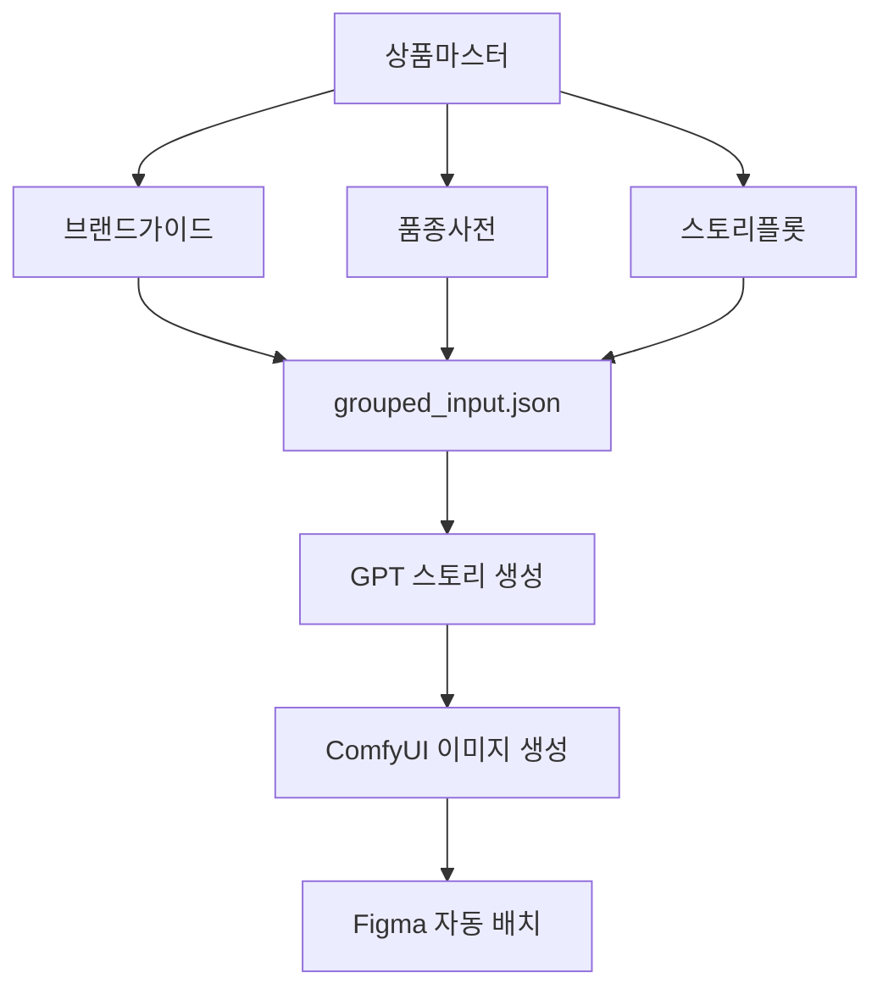

# 🧩 데이터 구조 설계 (실무 투입형 v2.0)

리오시스템_v1.0의 데이터 구조는 Google Sheets를 중심으로  
**AI 스토리빌더(GPT) → 로컬 변환엔진(ComfyUI) → 디자인 배치(Figma)** 로 이어지는 완전 자동 파이프라인을 지원한다.  
본 문서는 확장형 실무 투입 버전의 필드 정의, 데이터 관계, 활용 포인트를 상세 명세한다.

---

## 1. 시트 구성 개요

| 시트명 | 역할 | 주요 컬럼 수 | 설명 |
|--------|------|--------------|------|
| **상품마스터** | 데이터 중심축 | 18 | SKU, 품종, 브랜드, 스토리, 카테고리 등 핵심 입력 |
| **브랜드가이드** | 톤·스타일 기준 | 14 | 브랜드 색상·폰트·톤앤매너 정의 |
| **품종사전** | 이미지 파라미터 | 17 | 품종별 연출·렌즈·ControlNet 파라미터 |
| **스토리플롯** | 스토리 구조 | 13 | GPT 섹션별 톤·길이·형태 제어 |

---

## 2. 데이터 흐름 구조


> AUTO_GEN=TRUE인 행만 파이프라인을 통과하며
병합 결과는 /dist/grouped_input.json 으로 저장된다.


---

## 3. 상품마스터 시트 구조

| 컬럼명 | 타입 | 필수 | 허용값 | 설명 | AI 활용 포인트 |
|--------|------|------|--------|------|----------------|
| SKU | 문자열 | ✅ | `AA-BB-000` | 상품 고유코드 | 모든 Key 기준 |
| 상품명 | 문자열 | ✅ | - | 상품명 | GPT 타이틀 입력 |
| 브랜드코드 | 문자열 | ✅ | 브랜드가이드 참조 | 브랜드 구분 | 톤/컬러 상속 |
| 품종코드 | 문자열 | ✅ | 품종사전 참조 | 품종 카테고리 | 이미지·프롬프트 매칭 |
| 스토리ID | 문자열 | ✅ | 스토리플롯 참조 | 서사 구조 | GPT 스토리 조립 |
| AUTO_GEN | 체크박스 | ✅ | TRUE/FALSE | 자동 생성 여부 | 파이프라인 필터 |
| 카테고리코드 | 문자열 | ⛔ | 예: 식품>채소 | 대분류·소분류 | 문맥 자동 삽입 |
| 판매상태 | 드롭다운 | ⛔ | ACTIVE/PAUSE | 판매 제어 | 카피 문체 변경 |
| 가격대 | 숫자 | ⛔ | 원화 | 시세 정보 | 문장 변주 |
| 원산지 | 문자열 | ⛔ | - | 산지 정보 | 강조 문구 |
| 판매채널 | 문자열 | ⛔ | 콤마구분 | 노출채널 | 프롬프트 변주 |
| 특징키워드 | 문자열 | ⛔ | 콤마구분 | 주요 특성 | GPT 입력 핵심 |
| USP문구 | 문자열 | ⛔ | - | 대표 메시지 | Hero 섹션 문장 |
| 패키지타입 | 문자열 | ⛔ | - | 포장 형태 | Detail 문장 |
| 생성결과폴더 | 문자열 | ⛔ | `/output/{SKU}/v1/` | 결과 경로 | 로그 추적 |
| 상태 | 드롭다운 | ✅ | READY/HOLD/ERROR | 실행 상태 | 스크립트 조건 |
| 생성일시 | 날짜 | ⛔ | YYYY-MM-DD | 최초 입력 | 메타 기록 |
| 수정일시 | 날짜 | ⛔ | YYYY-MM-DD | 수정일 | 메타 기록 |

**헤더 복붙용** : 
SKU 상품명 브랜드코드 품종코드 스토리ID AUTO_GEN 카테고리코드 판매상태 가격대 원산지 판매채널 특징키워드 USP문구 패키지타입 생성결과폴더 상태 생성일시 수정일시

---

### 3-1. 데이터 상태 제어 규칙 (Execution Control)

리오시스템은 **상품마스터 시트의 상태값을 기준으로 자동 생성 파이프라인을 제어**한다.  
이 규칙은 중복생성을 방지하고, 수동 재생성을 안전하게 지원한다.

| 필드 | 역할 | 동작 규칙 |
|------|------|-----------|
| **AUTO_GEN** | 자동 생성 대상 여부 | TRUE일 때만 파이프라인 실행 대상 |
| **상태** | 처리 상태 관리 | READY → DONE → (필요 시) READY 로 순환 |
| **생성결과폴더** | 산출물 저장 위치 | `/output/{SKU}/v1/` 형태로 자동 기록 |

#### ⬛ 실행 조건
- `AUTO_GEN = TRUE` **AND** `상태 = READY` 인 행만 자동 생성 대상  
- 조건 불충족 시, 해당 SKU는 무시됨

#### ⬛ 처리 후 상태 갱신
| 처리결과 | AUTO_GEN | 상태 | 비고 |
|-----------|-----------|-------|------|
| 생성성공 | FALSE | DONE | 결과폴더 자동 기록 |
| 생성실패 | TRUE | ERROR | 재시도 대상 |
| 수동재생성 | TRUE | READY | 재실행 준비 |

#### ⬛ 수동 재생성 프로세스
1. `상태`를 READY로 변경  
2. `AUTO_GEN`을 TRUE로 체크  
3. 다음 실행 시 해당 SKU만 재생성  

> 💡 **요약:**  
> “상품마스터는 누적형 구조지만, 상태값으로 실행 제어를 하므로  
> 이미 생성된 상품은 다시 자동으로 생성되지 않는다.”

---

## 4. 브랜드가이드 시트 구조

| 컬럼명 | 타입 | 필수 | 설명 | AI 활용 포인트 |
|--------|------|------|------|----------------|
| 브랜드코드 | 문자열 | ✅ | 식별자 | Key 참조 |
| 브랜드명 | 문자열 | ✅ | 브랜드명 | 표기/문맥 |
| 대표컬러(hex) | 문자열 | ✅ | 기본 색상 | Figma 스타일 |
| 보조컬러(hex) | 문자열 | ⛔ | 서브 컬러 | 배경/하이라이트 |
| CTA컬러(hex) | 문자열 | ⛔ | CTA 버튼색 | 강조요소 |
| 폰트명 | 문자열 | ⛔ | 브랜드 폰트 | 텍스트 스타일 |
| 폰트웨이트기본 | 숫자 | ⛔ | 웨이트 | 톤 유지 |
| 폰트사이즈기준 | 숫자 | ⛔ | 기본 px | Figma 노드 |
| 톤앤매너(문체) | 문자열 | ⛔ | 문체 가이드 | GPT 문체 기준 |
| 비주얼톤(이미지) | 문자열 | ⛔ | 이미지 감성 | ComfyUI 톤 |
| LUT프리셋명 | 문자열 | ⛔ | 색보정 프리셋 | 이미지 일관화 |
| 이미지톤가이드URL | URL | ⛔ | 시각 가이드 문서 | QA 참고 |
| 로고URL | URL | ⛔ | 브랜드 로고 | Figma 배치 |
| FigmaStyleID | 문자열 | ⛔ | 스타일 매핑 ID | 플러그인 연결 |

**헤더 복붙용** : 
브랜드코드 브랜드명 대표컬러(hex) 보조컬러(hex) CTA컬러(hex) 폰트명 폰트웨이트기본 폰트사이즈기준 톤앤매너(문체) 비주얼톤(이미지) LUT프리셋명 이미지톤가이드URL 로고URL FigmaStyleID


---

## 5. 품종사전 시트 구조

| 컬럼명 | 타입 | 필수 | 설명 | AI 활용 포인트 |
|--------|------|------|------|----------------|
| 품종코드 | 문자열 | ✅ | 식별자 | 참조 Key |
| 품종명 | 문자열 | ✅ | 품종명 | 텍스트/이미지 |
| 색상키워드 | 문자열 | ⛔ | 색조 가이드 | 프롬프트 색상 |
| 형태키워드 | 문자열 | ⛔ | 형태 | 피사체 구조 |
| 배경키워드 | 문자열 | ⛔ | 배경 요소 | Scene 구성 |
| 연출키워드 | 문자열 | ⛔ | 촬영 연출 | Cut 구성 |
| 배경종류 | 드롭다운 | ⛔ | 단색/실사/블러 | Scene 타입 |
| 렌즈타입 | 드롭다운 | ⛔ | 35mm/50mm/85mm | 화각 제어 |
| 카메라앵글 | 드롭다운 | ⛔ | Eye/Top/Macro | 구도 제어 |
| 프레임비율 | 드롭다운 | ⛔ | 1:1/3:4/9:16 | Figma 연동 |
| 조명톤 | 문자열 | ⛔ | 조명조건 | 하이라이트/톤 |
| 피사체비율 | 문자열 | ⛔ | `80%` 등 | 구도 비율 |
| HDR강도 | 숫자 | ⛔ | 0~1 | 대비 제어 |
| NegativePrompt | 문자열 | ⛔ | 제외 키워드 | 품질 안정화 |
| 파라미터프리셋 | JSON | ⛔ | ComfyUI 노드 | 자동 주입 |
| 참조이미지URL | URL | ⛔ | 품종 참고 | IP-Adapter |
| 샘플시드 | 숫자 | ⛔ | 정수 | 재현성 제어 |

**헤더 복붙용** : 
품종코드 품종명 색상키워드 형태키워드 배경키워드 연출키워드 배경종류 렌즈타입 카메라앵글 프레임비율 조명톤 피사체비율 HDR강도 NegativePrompt 파라미터프리셋 참조이미지URL 샘플시드


---

## 6. 스토리플롯 시트 구조

| 컬럼명 | 타입 | 필수 | 설명 | AI 활용 포인트 |
|--------|------|------|------|----------------|
| 스토리ID | 문자열 | ✅ | 스토리 구조 ID | 병합 Key |
| 시퀀스순서 | 숫자 | ✅ | 섹션 순서 | 출력 순서 |
| 섹션타입 | 드롭다운 | ✅ | hero/usp/origin/detail | 섹션 분류 |
| 섹션명 | 문자열 | ✅ | 표기 이름 | UI 라벨 |
| 문체톤 | 문자열 | ⛔ | 문체 가이드 | GPT 톤 |
| 톤강도 | 숫자 | ⛔ | 1~5 | 문체 가중치 |
| 문장형태 | 드롭다운 | ⛔ | 서술/감탄/질문 | 문체 패턴 |
| 핵심메시지 | 문자열 | ⛔ | 요약 문장 | 스토리 축 |
| 금지어 | 문자열 | ⛔ | 제외 단어 | 품질 필터 |
| 문단길이기준 | 숫자 | ⛔ | 글자수 | 프롬프트 제한 |
| 이미지섹션매핑 | 문자열 | ⛔ | hero/usp1/origin | 이미지 Key |
| 이미지연결여부 | 체크박스 | ⛔ | TRUE/FALSE | 이미지 존재 |
| 출력여부 | 체크박스 | ✅ | TRUE/FALSE | 활성화 제어 |

**헤더 복붙용** : 
스토리ID 시퀀스순서 섹션타입 섹션명 문체톤 톤강도 문장형태 핵심메시지 금지어 문단길이기준 이미지섹션매핑 이미지연결여부 출력여부

---

### 6-1. 섹션타입 구조 정의 (Story Section Structure)

스토리플롯 시트의 **섹션타입(SectionType)** 은  
하나의 상품 상세페이지를 구성하는 **서사 단위 블록(Story Block)** 으로,  
GPT 텍스트 생성·ComfyUI 이미지 생성·Figma 배치의 기준이 된다.

---

#### 📘 구조 개념

```text
스토리ID (예: story_veg_01)
 ├─ 섹션타입: hero      → 첫 인상 (대표 문장 / 메인 이미지)
 ├─ 섹션타입: usp       → 차별점·특징
 ├─ 섹션타입: problem   → 고객 공감 구간
 ├─ 섹션타입: benefit   → 구체적 장점·효과
 ├─ 섹션타입: origin    → 산지·제조 스토리
 ├─ 섹션타입: proof     → 후기·인증·신뢰 구간
 ├─ 섹션타입: howto     → 사용법·활용 가이드
 ├─ 섹션타입: package   → 구성·패키지 정보
 ├─ 섹션타입: cta       → 구매 유도 (Call to Action)
 └─ 섹션타입: outro     → 브랜드 여운 / 마무리
```


**- 🧩 주요 섹션 타입 정의”**

| 섹션타입        | 역할       | 핵심 콘텐츠        | AI 생성 포인트         |
| ----------- | -------- | ------------- | ----------------- |
| **hero**    | 첫인상 / 주목 | 대표 문장, 대표 이미지 | 감성 중심 문장 (20자 이내) |
| **usp**     | 차별 포인트   | 3~4개의 특징 리스트  | 특징 키워드 기반 GPT 변환  |
| **problem** | 공감 유도    | 문제 → 해결 구조    | “당신도 이런 경험 있죠?” 톤 |
| **benefit** | 장점 강화    | 기능·효과·감정 결합   | 데이터+감성형 문장        |
| **origin**  | 스토리 / 신뢰 | 산지·제조공정       | 묘사·서사형 문체         |
| **proof**   | 후기 / 인증  | 리뷰, 수상, 인증서   | 신뢰 표현 문장          |
| **howto**   | 사용 가이드   | 사용법, 레시피      | 단계별 서술형           |
| **package** | 구성 설명    | 구성품 이미지 / 설명  | 시각 매칭 중심          |
| **cta**     | 전환 / 구매  | 가격, 혜택, 버튼    | 명령형 어투, 짧은 문장     |
| **outro**   | 마무리 / 철학 | 브랜드 철학, 여운    | 브랜드가이드 톤 매핑       |

---


**- 🎨 섹션-이미지 매핑 규칙 (ComfyUI)**

| 섹션타입                    | 이미지 파일명 규칙                           | 설명        |
| ----------------------- | ------------------------------------ | --------- |
| hero                    | `/output/{SKU}/hero.png`             | 메인 비주얼    |
| usp                     | `/output/{SKU}/usp1.png`, `usp2.png` | 특징 이미지    |
| origin                  | `/output/{SKU}/origin.png`           | 산지·브랜드컷   |
| package                 | `/output/{SKU}/package.png`          | 구성컷       |
| cta                     | `/output/{SKU}/cta.png`              | 배너형 CTA   |
| proof / howto / benefit | `/output/{SKU}/{section}.png`        | 상황별 가변 생성 |

-모든 섹션 이미지는 /output/{SKU}/ 하위 폴더에 자동 저장되며, meta.json에 섹션 매핑 정보가 기록된다.

---


**- 🧠 GPT 생성 프롬프트 예시**

| 섹션타입        | 예시 프롬프트                                       |
| ----------- | --------------------------------------------- |
| **hero**    | “상품의 첫인상을 1문장으로 표현하세요. 감성 키워드: 신선, 깨끗함, 자연.”  |
| **usp**     | “아래 키워드를 포함해 3개의 특징 문장을 작성하세요. 각 문장은 20자 이내.” |
| **origin**  | “산지와 생산 과정을 스토리텔링 형식으로 설명하세요. 브랜드 신뢰감을 주도록.”  |
| **package** | “패키지 구성과 편의성을 간단히 설명하세요. 소비자가 이해하기 쉽게.”       |
| **cta**     | “즉시 구매를 유도하는 문장을 2줄 이내로 작성하세요. 명확하고 간결하게.”    |

---


**- ⚙️ 실행 로직 요약**

스토리ID 기준으로 여러 섹션(row)이 하나의 상세페이지를 구성
시퀀스순서 기준으로 상단 → 하단 순서 출력
각 섹션은 GPT → ComfyUI → Figma 파이프라인을 순차 통과
출력여부 = TRUE 인 섹션만 실제 출력 대상

> 💬 요약: 한 상품(SKU)은 하나의 스토리ID를 가지고, 그 스토리ID 안의 여러 섹션타입이 상세페이지의 전체 흐름을 완성한다.


**- 🧭 데이터 유효성 참조**  

본 시트의 모든 입력 필드의 유효성 검증 및 조건부 서식 규칙은 `02_DataValidationSpec.md` 문서의 **2.4 스토리플롯 항목**을 따른다.


---

## 7. 데이터 관계

```text
상품마스터(SKU)
 ├─ 브랜드가이드(브랜드코드)
 ├─ 품종사전(품종코드)
 └─ 스토리플롯(스토리ID)
     ↓
  grouped_input.json → GPT → ComfyUI → Figma
```

---

## 8. 핵심 원칙

| 원칙        | 설명                                      |
| --------- | --------------------------------------- |
| **단방향성**  | Sheets → GPT → ComfyUI → Figma → Export |
| **자동화중심** | AUTO_GEN=TRUE만 처리                       |
| **참조무결성** | Key가 존재할 때만 병합                          |
| **확장성**   | 품종·스토리 시트 확장 가능                         |
| **로컬안정성** | ComfyUI 기반 오프라인 처리                      |


---

## 9. 실행 준비 체크리스트

| 항목                              | 상태      | 설명        |
| ------------------------------- | ------- | --------- |
| Google Sheets `AI 상세페이지_입력데이터`  | ✅ 생성완료  | 4 시트 반영   |
| Apps Script `dataValidation.gs` | 🔹 필요   | 유효성 검증용   |
| 샘플데이터 `sample_input.csv`        | ✅ 작성완료  | 테스트용      |
| 병합스크립트 `mergeBySKU.ts`          | ✅ 준비    | JSON 병합용  |
| 결과파일 `dist/grouped_input.json`  | 🔹 생성대기 | 첫 실행 시 자동 |


---

## 10. 슬로건

> **“데이터는 시스템의 언어이며, 정확한 구조는 자동화의 시작이다.”**


